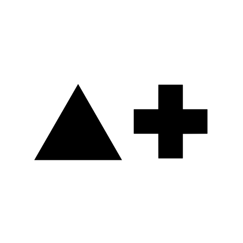

<p align="center">
  
</p>

---

My portfolio built with [Astro](https://astro.build), [Tailwind CSS](https://tailwindcss.com), and [GitHub](https://github.com).

## Running Locally

This application requires Node.js v18+.

```sh
git clone https://github.com/torn4dom4n/torn4dom4n.github.io
cd torn4dom4n.github.io
pnpm install
pnpm dev
```
